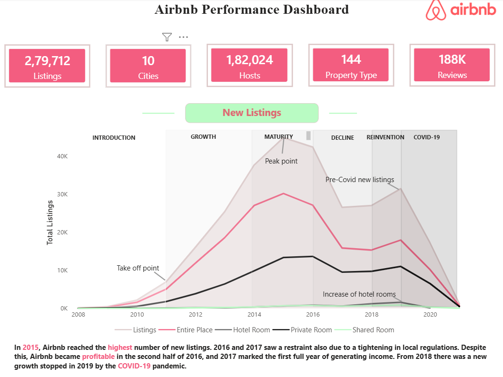
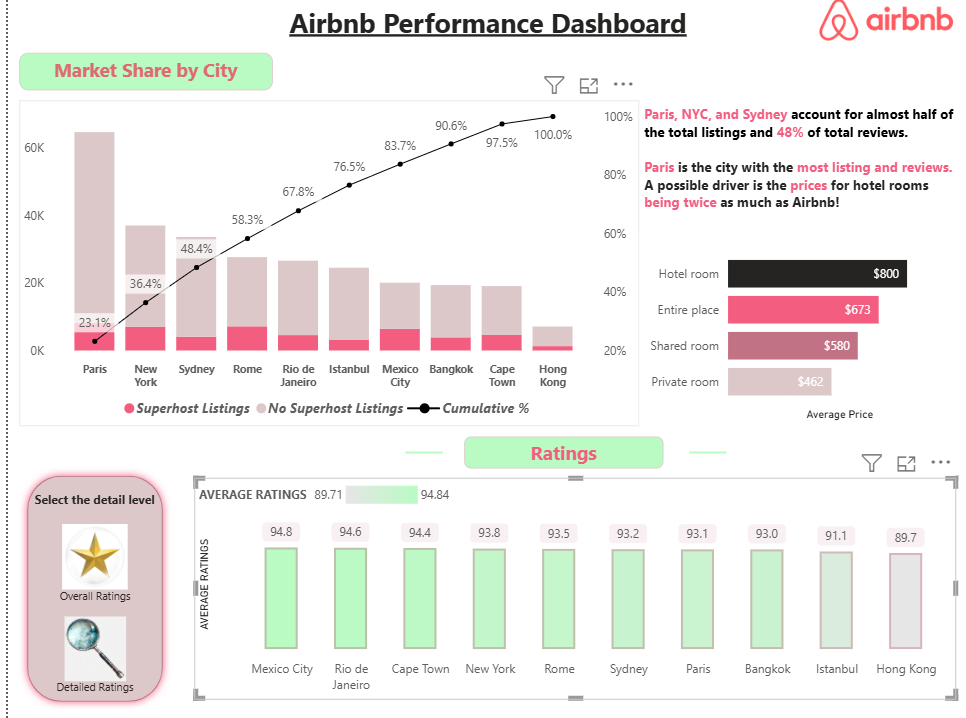
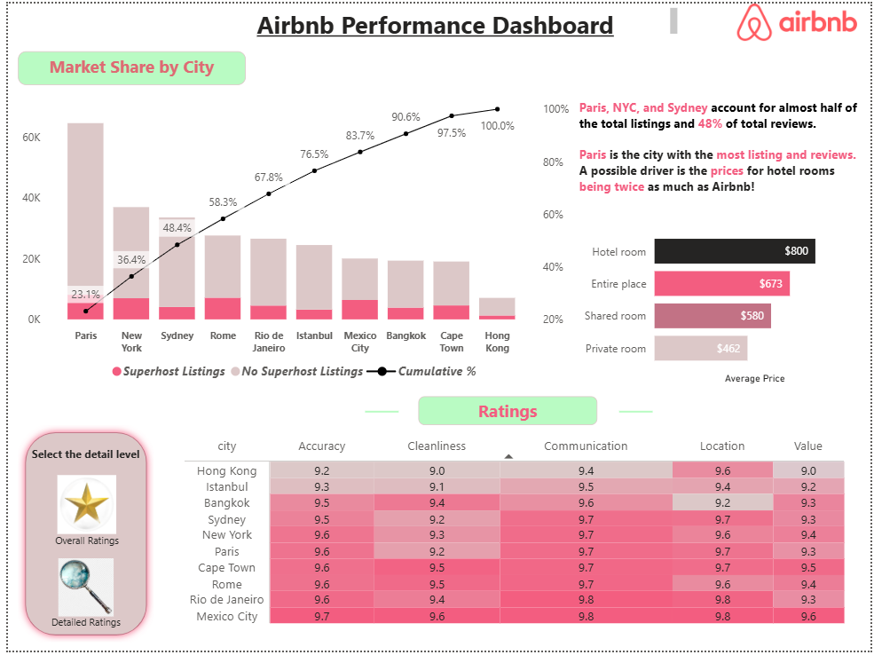
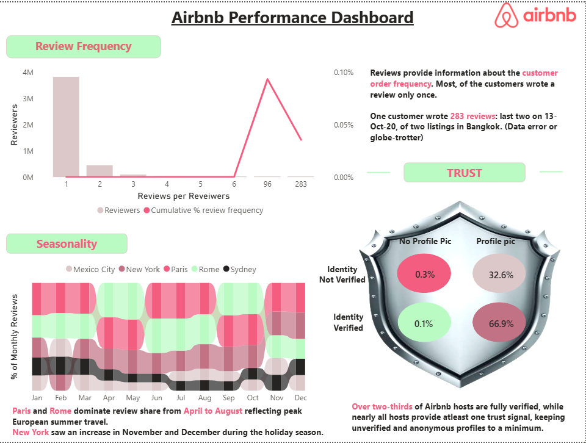

# Airbnb_Dashboard
# 🏡 Airbnb Performance Dashboard | Power BI

## 📌 Project Overview

An interactive **Power BI dashboard** built to analyze Airbnb listing performance across multiple global cities. The dashboard uncovers insights into market share, pricing, customer ratings, reviews, seasonality, host trust, and listing growth from **2008–2021**, helping stakeholders make data-driven business decisions.

---

## 🎯 Business Problem

Airbnb operates across thousands of listings and multiple cities, making it challenging for stakeholders to monitor business performance and identify growth opportunities.

The key business challenges include:

- Comparing market performance across different cities.
- Understanding pricing trends for various room types.
- Tracking listing growth over time.
- Measuring customer satisfaction using ratings and reviews.
- Identifying seasonal demand patterns.
- Evaluating host trust through identity verification and profile completeness.
- Understanding the impact of external events such as COVID-19 on Airbnb listings.

---

## 💡 Solution

Developed an interactive **Power BI dashboard** that transforms raw Airbnb data into meaningful business insights through interactive visualizations, KPI cards, drill-down analysis, and bookmark-based navigation.

---

## 🛠️ Tech Stack

- Power BI Desktop
- Power Query
- DAX (Data Analysis Expressions)
- Data Modeling
- Bookmarks
- Drill-through
- Conditional Formatting
- Interactive Slicers
- Excel / CSV Dataset

---

## 📂 Data Source

- Maven Analytics
- Data Period: **2008–2021**
- 10 Global Cities:
  - Paris
  - New York
  - Sydney
  - Rome
  - Rio de Janeiro
  - Istanbul
  - Mexico City
  - Bangkok
  - Cape Town
  - Hong Kong

---

## ✨ Dashboard Features

### 📊 Executive Dashboard
- KPI Cards
- Listings Overview
- Hosts Analysis
- Property Types
- Reviews Summary

### 📈 Market Share Analysis
- Pareto Analysis (80/20 Rule)
- Superhost vs Non-Superhost Comparison
- Cumulative Market Share

### ⭐ Ratings Dashboard
- Overall Ratings
- Detailed Ratings
- Heatmap Visualization
- Accuracy
- Cleanliness
- Communication
- Location
- Value

### 💰 Pricing Analysis
- Average Price by Room Type
- Hotel Room
- Entire Place
- Private Room
- Shared Room

### 📅 Listings Lifecycle Analysis
- Introduction
- Growth
- Maturity
- Decline
- Reinvention
- COVID-19 Impact

### 📝 Reviews Dashboard
- Review Frequency
- Customer Engagement
- Review Distribution
- Review Outlier Detection

### 🌍 Seasonality Analysis
- Monthly Review Trends
- Peak Tourism Months
- City-wise Seasonal Comparison

### 🛡️ Host Trust Analysis
- Identity Verification
- Profile Picture Analysis
- Trust Indicators

### 🎛️ Interactive Features
- Bookmarks
- Drill-down
- Dynamic Filters
- Interactive Navigation
- Responsive Layout

---

## 📊 Key Insights

- Paris, New York, and Sydney account for nearly half of all Airbnb listings.
- Paris records the highest number of listings and customer reviews.
- Entire Place is the most preferred accommodation type.
- Listings experienced rapid growth until 2015 before slowing due to regulations.
- COVID-19 caused a sharp decline in new listings.
- More than two-thirds of hosts are identity verified, indicating a high level of trust.

---

## 📁 Dashboard Pages

- Executive Overview
- Market Share Analysis
- Ratings Analysis
- Reviews & Trust Analysis

---

## 🎯 Skills Demonstrated

- Data Cleaning
- Data Transformation
- Data Modeling
- DAX
- KPI Design
- Dashboard Development
- Business Intelligence
- Data Storytelling
- Interactive Report Design
- Business Insights

---

## 📸 Dashboard Preview

### Executive Overview

### Market Share Dashboard

### Ratings Dashboard

### Reviews Dashboard

## 🚀 Project Outcome

This project demonstrates how business intelligence tools like **Power BI** can convert raw Airbnb data into actionable insights, enabling stakeholders to monitor performance, understand customer behavior, identify market trends, and make informed strategic decisions.

